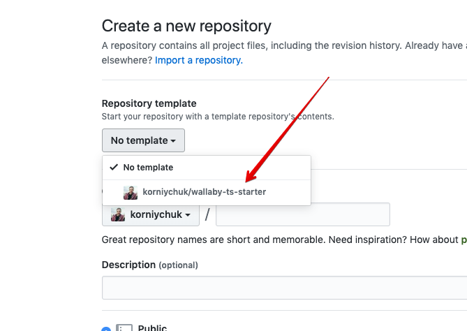
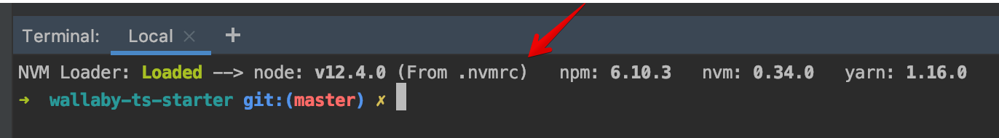

<p align="center">
  <a href="http://nestjs.com/" target="blank"></a>
</p>

[travis-image]: https://api.travis-ci.org/nestjs/nest.svg?branch=master
[travis-url]: https://travis-ci.org/nestjs/nest
[linux-image]: https://img.shields.io/travis/nestjs/nest/master.svg?label=linux
[linux-url]: https://travis-ci.org/nestjs/nest
  
  <p align="center">A progressive <a href="http://nodejs.org" target="blank">Node.js</a> framework for building efficient and scalable server-side applications, heavily inspired by <a href="https://angular.io" target="blank">Angular</a>.</p>
    <p align="center">
<a href="https://www.npmjs.com/~nestjscore"></a>
<a href="https://www.npmjs.com/~nestjscore"></a>
<a href="https://www.npmjs.com/~nestjscore"></a>
<a href="https://travis-ci.org/nestjs/nest"></a>
<a href="https://travis-ci.org/nestjs/nest"></a>
<a href="https://coveralls.io/github/nestjs/nest?branch=master"></a>
<a href="https://discord.gg/G7Qnnhy" target="_blank"></a>
</p>

## Description

[Nest](https://github.com/nestjs/nest) framework TypeScript starter repository.

## Main differences of [nestjs/typescript-starter](https://github.com/nestjs/typescript-starter):

* TypeScript [Path Aliases](/tsconfig.json#L29) configured
  * You can make imports like `import { ... } from '@app/...;`
  * You can add your own aliases
  * Aliases configuration in the one place [tsconfig.json](tsconfig.json#L29).
  * Jest & `module-alias` imports `paths` config using [ts-paths-fix](/src/ts-paths-fix-apply.ts)
* Yarn for packages installation and [`check-yarn`](/tools/check-yarn.js) utility to prevent packages installation via `npm`
* Additional Jest matchers from [`jest-extended`](https://github.com/jest-community/jest-extended) configured
* [ESLint](https://eslint.org) for linting JS & TS files ([TSLint is deprecated in 2019](https://github.com/palantir/tslint#tslint)).
* Very strict linting [config](/src/.eslintrc.js) ([airbnb](https://www.npmjs.com/package/eslint-config-airbnb-base) + [unicorn](https://www.npmjs.com/package/eslint-plugin-unicorn) + [some other plugins](/src/.eslintrc.js#L11))
* [`.nvmrc`](https://github.com/nvm-sh/nvm#nvmrc)
* Git hooks via [husky](https://www.npmjs.com/package/husky)
* [Utility](/tools/merge-with-repository-template.sh) to automatically pull updates from this template repository (`npm run tpl-repo:merge`)

**Other features:**

* Wallaby JS works out of the box without any additional config  
  Notice: How to run in "Without Configuration" mode ([Official Wallaby JS Guide](https://wallabyjs.com/docs/intro/config.html#automatic-configuration))

## Ways to use

1. Clone as is

    1. `git clone git@github.com:korniychuk/nestjs-starter.git`
    2. `cd nestjs-starter`
    3. `yarn`
2. Fork

    0. Click **Fork** git button
    1. `git clone git@github.com:YOUR_GIT_NAME/nestjs-starter.git`
    2. `cd nestjs-starter`
    3. `yarn`
3. Creating from template

    0. Click **Fork** git button
    1. Create new repository and specify template 
    1. `git clone git@github.com:YOUR_GIT_NAME/NEW_REPOSITORY_NAME.git`
    2. `cd NEW_REPOSITORY_NAME`
    3. `yarn`
4. Using with already cloned repository as an additional origin for pulling updates

    1. Automatically
    
       ```bash
       npm run merge-tpl-repo
       ```
    
    2. Manually

        1. `git remote add template git@github.com:korniychuk/nestjs-starter.git`
        2. `git fetch template`
        3. `git merge --allow-unrelated-histories template/master`

## How to

### How to use NodeJS version from the `.nvmrc`

1. Install NVM
2. Use `.nvmrc` file one of the next ways:

    * Execute `nvm use` in the project root directory
    * Install [NVM Loader](https://github.com/korniychuk/ankor-shell) and your .nvmrc will be loaded automatically when you open the terminal.
      
      
### Running the app

```bash
# development
$ npm run start

# watch mode
$ npm run start:dev

# debug mode
$ npm run start:debug

# production mode
$ npm run build:prod
$ npm run start:prod
```

### Test

```bash
# unit tests
$ npm run test

# watch mode
$ npm run test:watch

# specific tests
npm run test -- src/my.spec.ts
npm run test:watch -- src/my.spec.ts

# e2e tests
$ npm run test:e2e

# test coverage
$ npm run test:cov
```

### Lint

```bash
# Just show problems
$ npm run lint

# Fix problems if it is possible
$ npm run lint:fix
```

## Author

| [<br /><sub>Anton Korniychuk</sub>](https://korniychuk.pro) |
| :---: |
